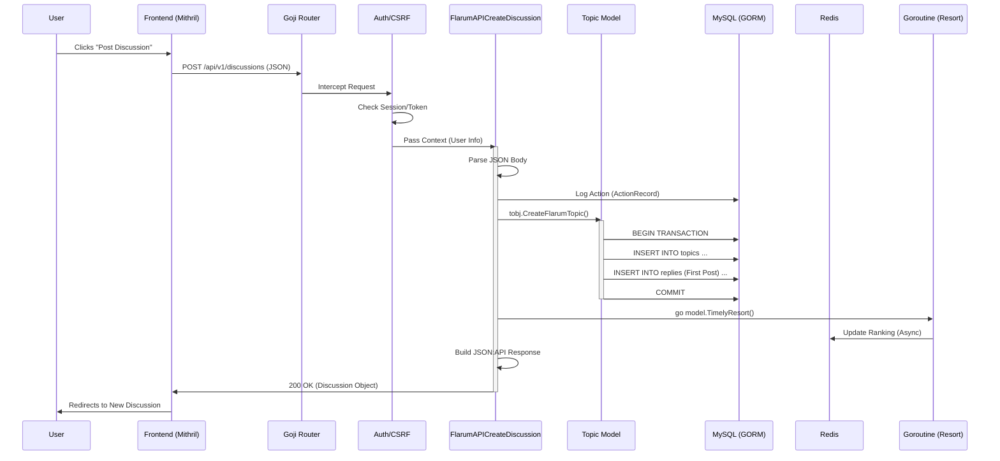

# Tutorial: Request Lifecycle in Go-Flarum

This tutorial traces the complete journey of a request in the Go-Flarum architecture, from the moment a user interacts with the frontend to the database write and back.

**Scenario**: A user creates a new discussion.

## 1. The High-Level Flow

1.  **Frontend (Mithril.js)**: Sends a `POST` request to `/api/v1/discussions`.
2.  **Router (Goji)**: Matches the URL and executes middleware (Auth, CSRF).
3.  **Controller (Go)**: Parses JSON, validates input, and orchestrates the logic.
4.  **Model (GORM)**: Executes a database transaction to save the Topic and Post.
5.  **Side Effect**: Triggers a background job to update topic rankings.
6.  **Response**: Returns a standardized JSON:API formatted response.

## 2. Sequence Diagram



## 3. Step-by-Step Code Walkthrough

### Step 1: Frontend Request
The Mithril frontend (standard Flarum code) sends a payload like this:
```json
{
  "data": {
    "type": "discussions",
    "attributes": {
      "title": "Hello World",
      "content": "This is my first post."
    },
    "relationships": {
      "tags": { "data": [ { "type": "tags", "id": "1" } ] }
    }
  }
}
```

### Step 2: Router Definition
**File:** `router/router.go`

The router maps the URL to the controller. It also wraps the handler in middleware chains.

```go
// router/router.go

// The generic API sub-router
NewFlarumAPIRouter(app, apiSP)

// Inside NewFlarumAPIRouter:
apiSP.HandleFunc(pat.Post("/discussions"), ct.MiddlewareArrayToChains(
    []ct.HTTPMiddleWareFunc{
        ct.MustAuthMiddleware, // 1. Ensures user is logged in
        ct.MustCSRFMiddleware, // 2. Validates CSRF token
    },
    ct.FlarumAPICreateDiscussion, // 3. The actual handler
))
```

### Step 3: Controller Logic
**File:** `controller/discussion.go`

The `FlarumAPICreateDiscussion` function handles the business logic.

```go
func FlarumAPICreateDiscussion(w http.ResponseWriter, r *http.Request) {
    // 1. Get Context (injected by AuthMiddleware)
    ctx := GetRetContext(r)
    h := ctx.h
    currentUser := ctx.currentUser

    // 2. Parse JSON Payload
    type PostedDiscussion struct { ... } // Struct matching the JSON above
    diss := PostedDiscussion{}
    json.Unmarshal(body, &diss)

    // 3. Prepare Model Object
    tobj := model.Topic{
        UserID:  currentUser.ID,
        Title:   diss.Data.Attributes.Title,
        Content: diss.Data.Attributes.Content,
        // ...
    }

    // 4. Resolve Relationships (Tags)
    for _, rela := range diss.Data.Relationships.Tags.Data {
        gormDB.First(&tag, rela.ID)
        tobj.Tags = append(tobj.Tags, tag)
    }

    // 5. Call Model to Save
    _, err = tobj.CreateFlarumTopic(gormDB)

    // 6. Trigger Background Task (Async)
    go model.TimelyResort()

    // 7. Format Response (JSON:API)
    coreData, _ := createFlarumPostAPIDoc(...)
    h.jsonify(w, coreData.APIDocument)
}
```

### Step 4: Model & Database Transaction
**File:** `model/topic.go`

Creating a discussion in Flarum involves two inserts: the `Topic` itself and the first `Post` (Reply). This must be atomic.

```go
func (topic *Topic) CreateFlarumTopic(gormDB *gorm.DB) (bool, error) {
    // 1. Start Transaction
    tx := gormDB.Begin()

    // 2. Insert Topic
    result := tx.Create(&topic) // topic.ID is generated here

    // 3. Create First Post
    comment := Comment{
        Reply: Reply{
            AID:     topic.ID, // Link to the new Topic
            UID:     topic.UserID,
            Content: topic.Content,
            Number:  1, // It's the first post
        },
    }
    result = tx.Create(&comment.Reply)

    // 4. Update Topic with Link to First Post
    topic.FirstPostID = comment.ID
    topic.LastPostID = comment.ID
    tx.Save(&topic)

    // 5. Commit Transaction
    result = tx.Commit()
    return true, nil
}
```

### Step 5: Response
The server sends back the created object in JSON:API format, which the Mithril frontend consumes to add the new discussion to the store and redirect the user.

## Key Takeaways for Go Developers

1.  **Context is King**: User session data is passed via `context.Context` from middleware to controllers (`GetRetContext`).
2.  **Transactions Matter**: Use `gormDB.Begin()` and `tx.Commit()` when modifying multiple tables (Topics + Posts).
3.  **Async Tasks**: Heavy operations like re-ranking are offloaded to goroutines (`go model.TimelyResort()`) to keep the API snappy.
